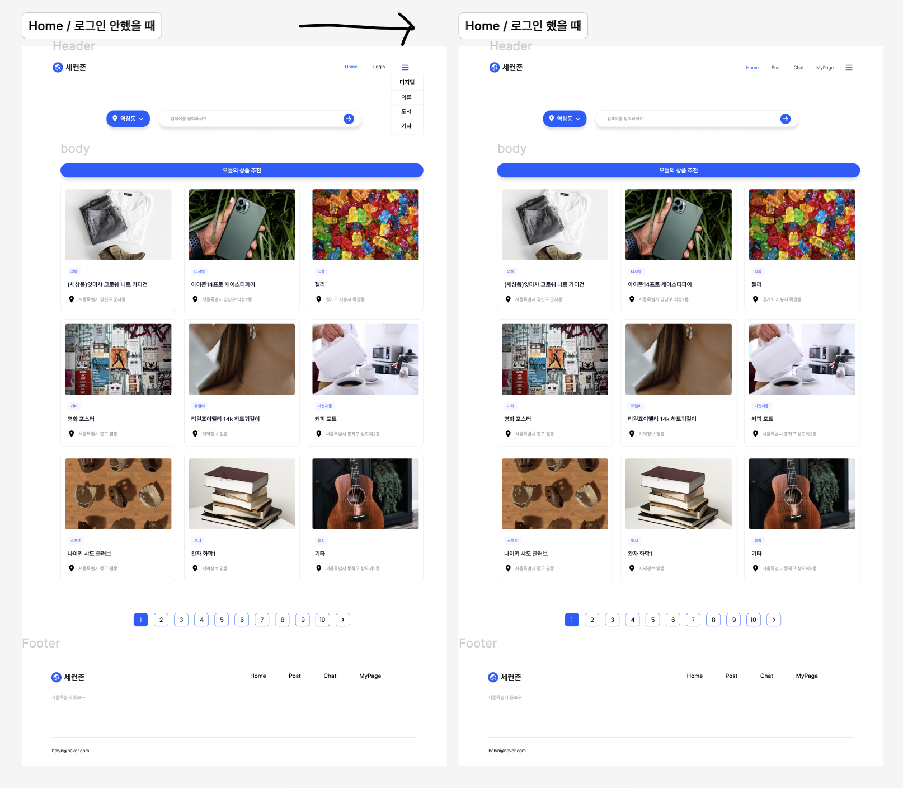
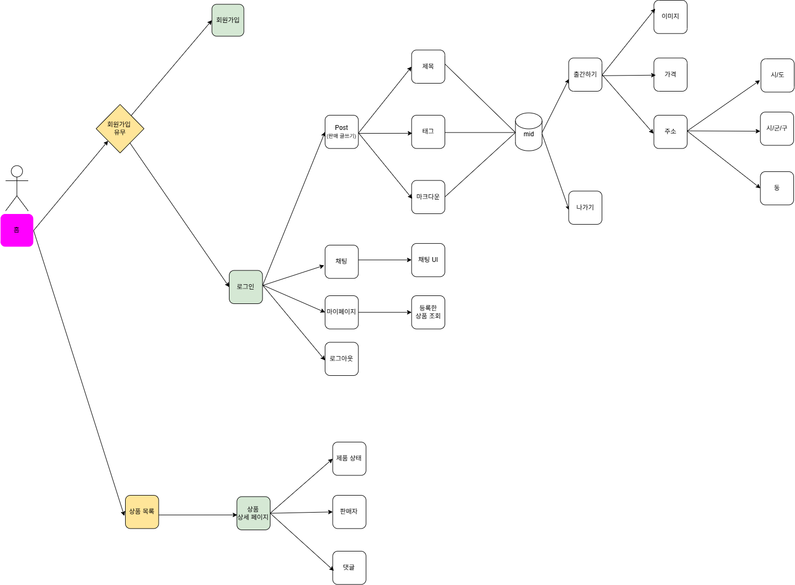
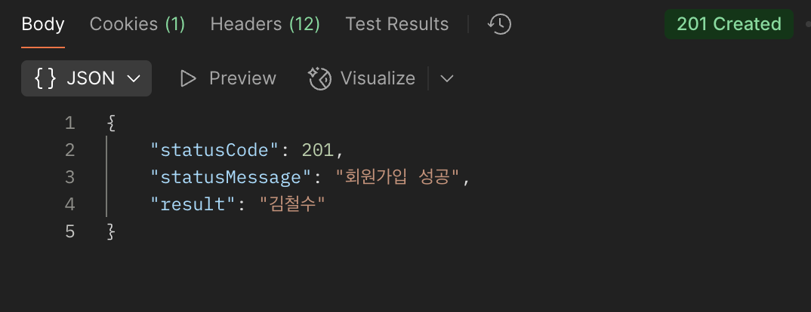
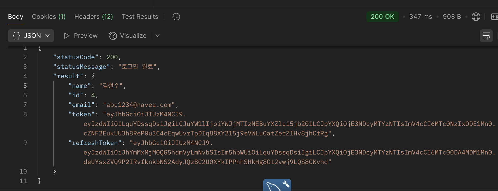
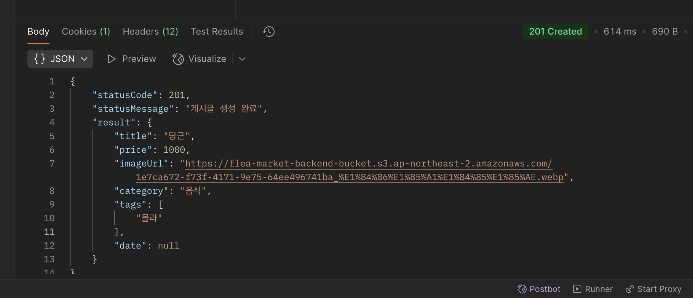
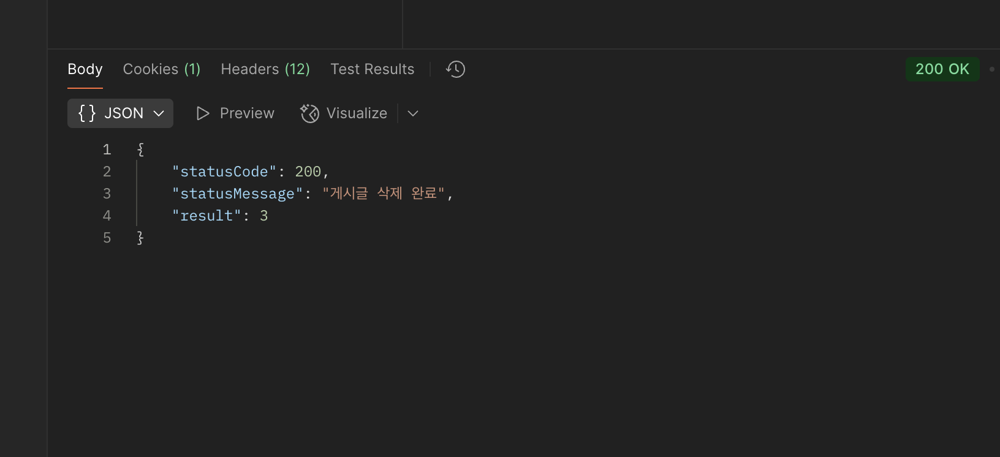

# Flea-Market 서비스 프로젝트

## 개요

**_프로젝트명_**: Flea-Market

**_프로젝트 기간_**: 2025-05-09 ~ 2025-05-15

**_팀장:_** 배주연

**_팀원:_** 구현희, 김사무엘, 주영찬

<br>
<br>

1.**프로젝트**

```
본 프로젝트는 마이크로 서비스 아키텍처를 적용한 온라인 중고 거래 서비스 플랫폼을 개발합니다.
사용자가 물건을 게시물 형식으로 등록해서 판매하고, 다른 사용자가 올린 상품을 구매할 수 있는 기능을 제공합니다.
```

<br>

2.**목표 및 범위**

```
이 프로젝트의 목표는 스프링 부트 구조를 이해하고, MSA를 통해 확장성과 유지보수성이 뛰어난 
서비스를 구현하는 것이 목표입니다. 또한 프론트엔드와의 연동에 익숙해져서 서비스 전반의 흐름을
이해하는 것입니다.
```

<br>

3.**타겟 사용자**

```
판매자, 구매자
```

<br>

4.**주요 기능 목록**

```
사용자 등록/로그인, 상품 등록, 상품 거래, 내 정보 페이지 조회
```

<br>

5.**기술 스택**

```
Spring Boot, Spring cloud, React, Css, MySQL, AWS (EC2 S3) , Redis
```

<br>

6.**마이크로서비스 구조**

```
사용자 서비스, 상품 서비스, 게시글 서비스, 거래 서비스, 구성(설정) 서비스, API 게이트웨이, 유레카 서버
```

<br>

##

<br>

**===== 사용자 서비스 API =====**

1. 회원가입

- URL: POST /user-service/user/signup
- Request Body :

```json
{
	“name”: “박영희”,
	 “email”: “park9876@naver.com”,
	 “password”: “ppp1111!”
}
```

- Response ( 성공 - 201 Created )

```json
{
    "statusCode": 201,
    "statusMessage": "회원가입 성공",
    "result": “박영희”
}
```

2.  로그인

- URL: POST /user-service/user/login
- Request Body:

```json
{
    "email": “park9876@naver.com",
    "password": “ppp1111!”
}
```

- Response (성공 - 200 OK):

```json
{
    "statusCode": 200,
    "statusMessage": "로그인 완료",
    "result":
    {
        "name": "박영희",
        "id": 4,
        "email": "abc1234@naver.com",
        "token": "eyJhbGciOiJIUzM4NCJ9.eyJzdWIiOi…”,
        "refreshToken": "eyJhbGciOiJIUzM4NCJ9.eyJ…”
    }
}
```

3. Refresh

- URL: POST /user-service/user/refresh
- Request Body:

```json
{
    “id” :“4”,
    "password": “ppp1111!”
     "refreshToken": "eyJhbGciOiJIUzM4NCJ9.eyJ…”
}
```

- Response (성공 - 200 OK):

```json
{
    "statusCode": 200,
    "statusMessage": "로그인 완료",
    "result":
    {
        "name": "박영희",
        "id": 4,
        "email": "abc1234@naver.com",
        "token": "eyJhbGciOiJIUzM4NCJ9.eyJzdWIiOi…”,
        "refreshToken": "eyJhbGciOiJIUzM4NCJ9.eyJ…”
    }
}
```

**===== 게시글 서비스 API =====**

1. 게시글 등록

- URL: POST /board-service/board/create
- Request Body :

```json
{
  "title": "당근",
  "price": 1000,
  "imageUrl": "https://flea-market-backend-bucket.s3.ap-northeast-2.amazonaws.com/1e7ca672-f73f-4171-9e75-64ee496741ba_%E1%84%86%E1%85%A1%E1%84%85%E1%85%AE.webp",
  "category": "음식",
  "tags": ["몰라"]
}
```

- Response ( 성공 - 201 Created )

```json
{
  "statusCode": 201,
  "statusMessage": "게시글 생성 완료",
  "result": {
    "title": "당근",
    "price": 1000,
    "imageUrl": "https://flea-market-backend-bucket.s3.ap-northeast-2.amazonaws.com/1e7ca672-f73f-4171-9e75-64ee496741ba_%E1%84%86%E1%85%A1%E1%84%85%E1%85%AE.webp",
    "category": "음식",
    "tags": ["몰라"],
    "date": null
  }
}
```

2. 게시글 삭제

- URL : DELETE /board-service/board/{boardId}
- Response ( 성공 - 201 Created )

```json
{
  "statusCode": 200,
  "statusMessage": "게시글 삭제 완료",
  "result": 3
}
```

<br>

# 전체 API 모음

https://www.notion.so/api-1ed63eaa605180bea1bedb7d9834bd3b


<br>

2. **서비스 간 통신 설계**: 마이크로서비스 간의 통신 방식을 정의합니다.

서버스 간 통신 설계 <br>
게시글 서비스 -> 제품 서비스 <br>
목적: 유저가 등록한 게시글의 제품을 product table에 저장 <br>
통신 방식: REST API 호출 (Feign Client) <br>
엔드포인트: /product-service/product/create 

거래 서비스 -> 게시글 서비스 <br>
목적: 게시글의 거래 상태 변경 <br>
통신 방식: REST API 호출 (Feign Client) <br>
엔드포인트: /board-service/board/{boardId}

거래 서비스 -> 제품 서비스 <br>
목적: 제품의 거래 상태 변경 <br>
통신 방식: REST API 호출 (Feign Client) <br>
엔드포인트: /product-service/product/{prodId}

<br> <br>

## UI 화면 설계


<br> <br/>


<br> <br/>

## 테스트 케이스

https://docs.google.com/spreadsheets/d/1DlyYJ0suZVJMFSs_Ha9LRBqOKzVu4d8D9O_uQULe4dg/edit?gid=0#gid=0


## 테스트 결과

https://docs.google.com/spreadsheets/d/1DlyYJ0suZVJMFSs_Ha9LRBqOKzVu4d8D9O_uQULe4dg/edit?gid=0#gid=0

  
<br> <br/>
  
<br> <br/>
  
<br> <br/>
  